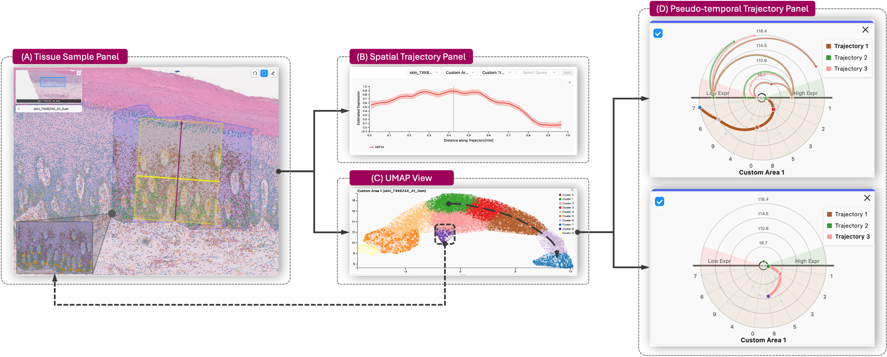

# Loom  

   
    
  [<a href="https://github.com/ScheWann/Loom_General">General Glyph Repo</a>] • 
  [<text href="YOUR_WEBSITE">Website</text>] • 
  [<text href="YOUR_PAPER_LINK">Paper</text>]

## Overview

**Loom** is a visual analytics system for spatiotemporal exploration of spatial transcriptomics data, designed to support multi-resolution analysis and cross-sample comparison. Enabling researchers to seamlessly integrate spatial organization, pseudo-temporal progression, and gene expression dynamics through coordinated views and a novel glyph-based encoding.

**Loom: Multi-Region Analysis of Spatial Transcriptomics with Local Neighborhoods and Global Trajectories**  
Siyuan Zhao, Nafiul Nipu, Hossein Fathollahian, Hao Chen, Ameen Salahudeen, Olga Karginova, G. Elisabeta Marai  

**Paper**: *Under review*

  

## Key Features
- Supports 2µm / 8µm / 16µm Visium HD data
- Cross-resolution alignment via spatial coordinate registration
- Efficient trajectory inference at appropriate resolutions
- Interactive exploration of spatial trajectories + pseudo-time progression  
- Comparative analysis across ROIs and samples  
- Novel glyph-based encoding

## License
Loom is MIT Licensed. Free for both commercial and research use.
