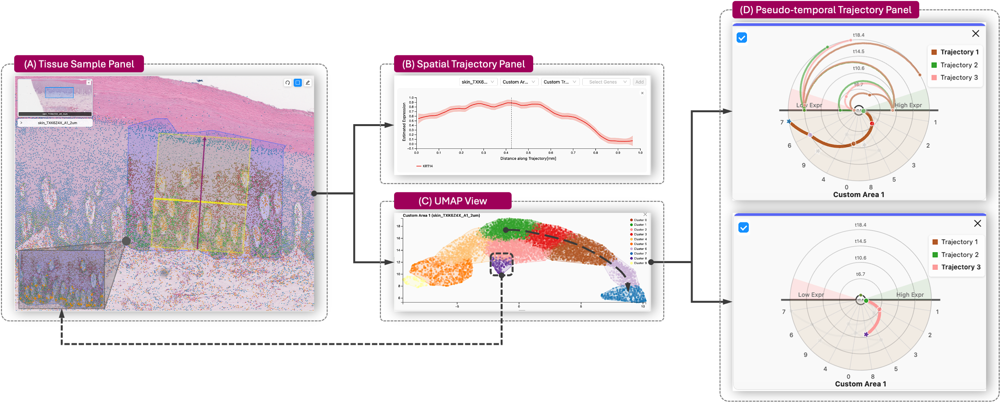

# Loom  

<div align="center">
  <br/>
  <br/><br/>
  [<a href="https://github.com/ScheWann/Loom_General">General Glyph Repo</a>] • 
  [<a href="https://arcade.evl.uic.edu/loom/">Website</a>] • 
  [<a href="https://arxiv.org/abs/2607.22505">Paper</a>]
</div>


## Overview

**Loom** is a visual analytics system for spatiotemporal exploration of spatial transcriptomics data, designed to support multi-resolution analysis and cross-sample comparison. Enabling researchers to seamlessly integrate spatial organization, pseudo-temporal progression, and gene expression dynamics through coordinated views and a novel glyph-based encoding.

**Loom: Multi-Region Analysis of Spatial Transcriptomics with Local Neighborhoods and Global Trajectories**  
Siyuan Zhao, Nafiul Nipu, Hossein Fathollahian, Hao Chen, Ameen Salahudeen, Olga Karginova, G. Elisabeta Marai  

**Paper**: IEEE Transactions on Visualization and Computer Graphics, Jan 2027

<div align="center">
  
</div>


## Data
Sample data can be found at https://osf.io/phtzr/. The data was fully de-identified in accordance with an approved IRB protocol prior to its use in this study.


## Why Loom?
Spatial transcriptomics workflows often require researchers to move between multiple tools when analyzing regions, resolutions, and trajectories. Loom complements the existing Python ecosystem by providing an integrated visual environment for:

- Exploring Visium HD data at 2 µm, 8 µm, and 16 µm resolutions
- Aligning spatial coordinates across resolutions
- Performing trajectory inference at computationally appropriate resolutions
- Interactively examining spatial trajectories and pseudotime progression
- Comparing regions of interest across samples
- Representing multivariate patterns through a novel glyph design

## Ecosystem Compatibility
Loom builds on widely adopted spatial transcriptomics technologies rather than replacing them. It supports AnnData-based workflows, integrates with Scanpy and Squidpy, processes 10x Genomics Visium HD datasets, and can be deployed through Docker.


## Running with Docker

The whole stack (a Flask/Gunicorn backend and a React frontend) is containerized, so Docker is the recommended way to run Loom. You only need [Docker](https://docs.docker.com/get-docker/) and the Docker Compose plugin installed.

Place your processed sample folders inside `Example_Data/` and make sure each sample is registered in `Backend/samples_list.json`. The easiest way to produce both is the one-command preprocessing pipeline described below.

```bash
# from the repository root
docker compose up -d --build
```

## Preprocessing

Loom consumes raw [10x Visium HD](https://www.10xgenomics.com/products/visium-hd-spatial-gene-expression) outputs (the `binned_outputs` folder plus the full-resolution H&E `.tif`) and turns them into the per-sample files the backend and frontend expect. The `Python/Preprocessing/` directory holds both the step-by-step notebooks and a single scripted entry point.

### What the pipeline does

| Step | File | Purpose |
| ---- | ---- | ------- |
| 0 | `0.image_preprocessing.ipynb` | Export a high-quality HD JPEG of the H&E image (the frontend builds its minimap from it). |
| 1 | `1.bin2cell.ipynb` | 2µm: aggregate 2µm bins into single cells with [bin2cell](https://github.com/Teichlab/bin2cell) (StarDist nuclei segmentation on H&E + GEX). |
| 1.5 | `1.5.quality_control_2um.ipynb` | 2µm: quality control + cell-type annotation. |
| 2 | `2.quality_control_8um.ipynb` | 8µm: quality control + cell-type annotation. |
| 3 | `3.quality_control_16um.ipynb` | 16µm: quality control + cell-type annotation. |
| 4 | `4.spata_processing.R` | Build the 16µm [SPATA2](https://github.com/theMILOlab/SPATA2) object (`.rds`) used for trajectory inference. |

Quality control follows a MAD-based outlier filter → `normalize_total` → `log1p` → [CellTypist](https://www.celltypist.org/) annotation. Global clustering (HVG / scale / PCA / UMAP / Leiden) is intentionally skipped by default because the backend re-clusters per ROI online; pass `--with-clustering` if you want the notebook-identical artifact.

The notebooks are useful for inspecting each stage interactively. For ingesting a new dataset, use the one-command script below — it is the non-interactive equivalent of all of the steps above and also registers the sample automatically.

### One-command dataset import

`generate_dataset.py` runs the full pipeline, writes the outputs into `Example_Data/` using the expected per-sample folder layout, and adds/merges the sample entry into `Backend/samples_list.json`:

```bash
cd Python/Preprocessing
python generate_dataset.py \
  --name Mouse_Brain \
  --binned-outputs "./binned_outputs" \
  --source-image  "./Visium_HD_Mouse_Brain_tissue_image.tif" \
  --scales 8um \
  --celltypist-model Mouse_Isocortex_Hippocampus.pkl \
  --mito-prefix mt-
```

> The 16µm SPATA2 `.rds` (used for trajectory inference) is generated **by default**. Add `--no-spata2` to skip it if you don't have R / SPATA2 installed.

Key arguments:

| Argument | Description |
| -------- | ----------- |
| `--name` | Sample display name / id (e.g. `Mouse_Brain`). |
| `--binned-outputs` | Path to the Visium HD `binned_outputs` directory (contains `square_002um/008um/016um`). |
| `--source-image` | Path to the full-resolution H&E source image (`.tif` / `.tiff`). |
| `--scales` | Comma-separated scales to generate from `{2um, 8um, 16um}` (e.g. `8um` or `2um,8um,16um`). |
| `--celltypist-model` | CellTypist model name — must match the tissue/species. Downloaded automatically if missing. |
| `--mito-prefix` | Mitochondrial gene prefix (`MT-` for human, `mt-` for mouse). |
| `--no-spata2` | Skip building the 16µm SPATA2 `.rds`. By default the `.rds` is generated (requires `Rscript` + SPATA2 on `PATH`) for trajectory analysis. |

Run `python generate_dataset.py --help` for the full list of options (`--with-clustering`, `--min-bins`, `--n-top-genes`, `--no-hd-jpeg`, `--no-16um-refs`, naming overrides, etc.).

Once the script finishes, restart the backend so the new sample appears in the app.

## License
Loom is MIT Licensed. Free for both commercial and research use.
